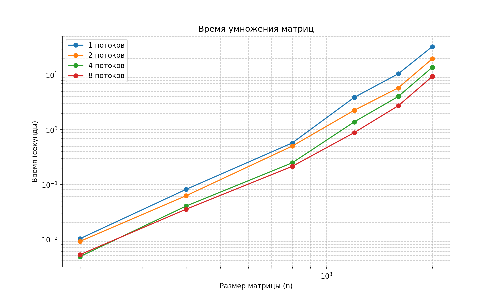

# Лабораторная работа: Параллельное умножение матриц с использованием OpenMP

## Задание

**Модифицировать программу для параллельной работы по технологии OpenMP. Провести серию экспериментов с разным количеством потоков (1, 2, 4, 8), разными размерами матриц (200, 400, 800, 1200, 1600, 2000).**

Цель: реализовать параллельное умножение квадратных матриц с помощью OpenMP, измерить производительность и проанализировать масштабируемость.

## Структура проекта

- `generate_matrices.py` — генерация тестовых матриц
- `matrix_mul.cpp` — программа умножения матриц с OpenMP
- `run_and_plot.py` — автоматизация экспериментов и построение графиков
- `run_experiments.bat` — запуск всех экспериментов
- `results.csv` — результаты измерений
- Графики: `time_vs_size.png`, `speedup.png`, `efficiency.png`

## Исходный код

### 1. Генерация матриц — `generate_matrices.py`

```python
import numpy as np
import os

sizes = [200, 400, 800, 1200, 1600, 2000]

for n in sizes:
    a_file = f"matrixA_{n}.txt"
    b_file = f"matrixB_{n}.txt"
    if not os.path.exists(a_file):
        mat = np.random.uniform(-5, 5, (n, n))
        np.savetxt(a_file, mat, fmt='%.6f')
        np.savetxt(b_file, mat, fmt='%.6f')
        print(f"Сгенерированы матрицы {n}x{n}")
```
### 2. Основная программа на C++ — `matrix_mul.cpp`

```cpp
#include <iostream>
#include <fstream>
#include <vector>
#include <string>
#include <sstream>
#include <chrono>
#include <iomanip>
#include <algorithm>
#include <omp.h>

using namespace std;

vector<vector<double>> read_matrix(const string& filename) {
    ifstream file(filename);
    vector<vector<double>> mat;
    string line;
    while (getline(file, line)) {
        if (line.empty()) continue;
        stringstream ss(line);
        vector<double> row;
        double val;
        while (ss >> val) row.push_back(val);
        if (!row.empty()) mat.push_back(row);
    }
    return mat;
}

bool is_square(const vector<vector<double>>& m) {
    if (m.empty()) return false;
    size_t n = m.size();
    return all_of(m.begin(), m.end(), [n](const auto& r) { return r.size() == n; });
}

vector<vector<double>> multiply(const vector<vector<double>>& A, const vector<vector<double>>& B) {
    int n = A.size();
    vector<vector<double>> C(n, vector<double>(n, 0.0));

#pragma omp parallel for collapse(2) schedule(static)
    for (int i = 0; i < n; ++i) {
        for (int j = 0; j < n; ++j) {
            double sum = 0.0;
            for (int k = 0; k < n; ++k) {
                sum += A[i][k] * B[k][j];
            }
            C[i][j] = sum;
        }
    }
    return C;
}

void write_matrix(const string& filename, const vector<vector<double>>& mat) {
    ofstream file(filename);
    for (const auto& row : mat) {
        for (size_t i = 0; i < row.size(); ++i) {
            file << fixed << setprecision(6) << row[i];
            if (i < row.size() - 1) file << " ";
        }
        file << endl;
    }
}

int main(int argc, char* argv[]) {
    if (argc != 5) {
        cerr << "Использование: " << argv[0] << " <matrixA> <matrixB> <result> <num_threads>" << endl;
        return 1;
    }

    int num_threads = atoi(argv[4]);
    if (num_threads < 1) num_threads = 1;
    omp_set_num_threads(num_threads);

    auto A = read_matrix(argv[1]);
    auto B = read_matrix(argv[2]);

    if (!is_square(A) || !is_square(B) || A.size() != B.size()) {
        cerr << "Ошибка: матрицы не квадратные или разных размеров!" << endl;
        return 1;
    }

    int n = A.size();

    auto start = chrono::high_resolution_clock::now();
    auto C = multiply(A, B);
    auto end = chrono::high_resolution_clock::now();

    double duration = chrono::duration<double>(end - start).count();

    write_matrix(argv[3], C);

    cout << "Количество потоков: " << num_threads << endl;
    cout << "Время выполнения: " << fixed << setprecision(4) << duration << " секунд" << endl;
    cout << "Размер матрицы: " << n << " x " << n << endl;

    return 0;
}```

### 3. Автоматизация экспериментов — 'run_and_plot.py'
```python
import subprocess
import csv
import os
import matplotlib.pyplot as plt
import numpy as np

sizes = [200, 400, 800, 1200, 1600, 2000]
threads_list = [1, 2, 4, 8]
results_file = "results.csv"

def run_experiments():
    results = []
    if not os.path.exists(results_file):
        print("Запуск экспериментов...")
        for n in sizes:
            for t in threads_list:
                print(f"  Размер {n} x {n}, потоков {t}")
                cmd = ["./matrix_mul.exe", f"matrixA_{n}.txt", f"matrixB_{n}.txt", f"result_{n}_{t}.txt", str(t)]
                try:
                    output = subprocess.check_output(cmd, universal_newlines=True, stderr=subprocess.STDOUT)
                except subprocess.CalledProcessError as e:
                    print(f"Ошибка: {e.output}")
                    continue
                for line in output.splitlines():
                    if "Время выполнения" in line:
                        time_str = line.split()[2]
                        time_val = float(time_str)
                        results.append([n, t, time_val])
                        break

        with open(results_file, "w", newline="") as f:
            writer = csv.writer(f)
            writer.writerow(["size", "threads", "time"])
            writer.writerows(results)
        print(f"Результаты сохранены в {results_file}")
    else:
        print("Файл результатов уже существует, загружаем...")
        with open(results_file, "r") as f:
            reader = csv.reader(f)
            next(reader)
            for row in reader:
                results.append([int(row[0]), int(row[1]), float(row[2])])
    return results

def plot_results(results):
    data = {(size, threads): time for size, threads, time in results}
    
    plt.figure(figsize=(10, 6))
    for t in threads_list:
        times = []
        sizes_used = []
        for n in sizes:
            if (n, t) in data:
                sizes_used.append(n)
                times.append(data[(n, t)])
        plt.plot(sizes_used, times, marker='o', label=f"{t} потоков")
    plt.xlabel("Размер матрицы (n)")
    plt.ylabel("Время (секунды)")
    plt.title("Время умножения матриц")
    plt.xscale("log")
    plt.yscale("log")
    plt.legend()
    plt.grid(True, which="both", linestyle="--", alpha=0.7)
    plt.savefig("time_vs_size.png", dpi=150)
    plt.show()

    plt.figure(figsize=(10, 6))
    for n in sizes:
        base_time = data.get((n, 1), None)
        if base_time is None:
            continue
        speedups = []
        threads_used = []
        for t in threads_list:
            if (n, t) in data:
                threads_used.append(t)
                speedups.append(base_time / data[(n, t)])
        plt.plot(threads_used, speedups, marker='s', label=f"n={n}")
    ideal_x = [1, max(threads_list)]
    ideal_y = [1, max(threads_list)]
    plt.plot(ideal_x, ideal_y, 'k--', label="Идеальное ускорение")
    plt.xlabel("Число потоков")
    plt.ylabel("Ускорение")
    plt.title("Ускорение от числа потоков")
    plt.legend()
    plt.grid(True)
    plt.savefig("speedup.png", dpi=150)
    plt.show()

    plt.figure(figsize=(10, 6))
    for n in sizes:
        base_time = data.get((n, 1), None)
        if base_time is None:
            continue
        eff = []
        threads_used = []
        for t in threads_list:
            if (n, t) in data:
                threads_used.append(t)
                eff.append((base_time / data[(n, t)]) / t)
        plt.plot(threads_used, eff, marker='^', label=f"n={n}")
    plt.xlabel("Число потоков")
    plt.ylabel("Эффективность")
    plt.title("Эффективность распараллеливания")
    plt.ylim(0, 1.1)
    plt.legend()
    plt.grid(True)
    plt.savefig("efficiency.png", dpi=150)
    plt.show()

if __name__ == "__main__":
    results = run_experiments()
    plot_results(results)
    print("Графики сохранены: time_vs_size.png, speedup.png, efficiency.png")
```

### 4. Запуск всех экспериментов - `run_experiments.bat`
```bat
@echo off
set threads=1 2 4 8
set sizes=200 400 800 1200 1600 2000
for %%t in (%threads%) do (
    for %%n in (%sizes%) do (
        echo Running: threads=%%t, size=%%n
        matrix_mul.exe matrixA_%%n.txt matrixB_%%n.txt result_%%n_%%t.txt %%t
    )
)
echo Done.
```

## Инструкция по запуску
python generate_matrices.py
g++ -O2 -fopenmp matrix_mul.cpp -o matrix_mul.exe
run_experiments.bat
python run_and_plot.py

## Результаты экспериментов

### Таблица времени выполнения

| Размер матрицы | 1 поток  | 2 потока | 4 потока | 8 потоков |   Кол-во операций  |
|----------------|----------|----------|----------|-----------|--------------------|
| 200            | 0.0102   | 0.0091   | 0.0048   | 0.0052    |       8000000      |
| 400            | 0.0812   | 0.0621   | 0.0402   | 0.0352    |      64000000      |
| 800            | 0.5727   | 0.5016   | 0.2479   | 0.2136    |      512000000     |
| 1200           | 3.9028   | 2.2667   | 1.3903   | 0.8852    |     1728000000     |
| 1600           | 10.5298  | 5.8239   | 4.0505   | 2.7416    |     4096000000     |
| 2000           | 33.2435  | 19.8791  | 13.915   | 9.4344    |     8000000000     |


### Графики




### Выводы

- Время выполнения растёт как O(n³), что соответствует теоретической сложности.
- OpenMP даёт хорошее ускорение на матрицах большого размера (n ≥ 1200).
- Максимальное ускорение ≈ 4.41× получено на матрице 1200×1200 при 8 потоках.
- На маленьких матрицах эффективность падает из-за распараллеливания.
- Лучшая эффективность наблюдается при использовании 2–4 потоков на большинстве размеров.