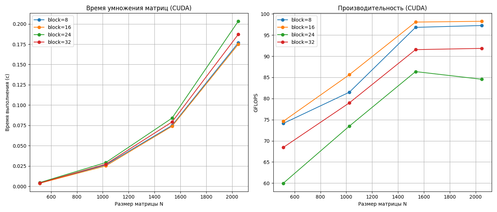

# Отчёт: Умножение двух квадратных матриц на C++ по технологии CUDA
 
**Цель:** Написать программу на C++ для умножения матриц по технологии CUDA, обеспечить ввод/вывод через файлы, измерение времени и объёма задачи, автоматизированную верификацию на Python + NumPy, провести эксперименты для размеров 512-2048.

## 1. Описание решения

### Программа на C++
- **Вход:** два файла `matrixA_N.txt` и `matrixB_N.txt` (матрицы хранятся построчно, через пробел, без заголовка с N).
- **Выход:** файл `result_N.txt` (результирующая матрица), плюс в консоль:
  - Время выполнения умножения.
  - Размер матрицы N × N.
  - Объём задачи (N³ операций).
- Компиляция: `nvcc -o matrix_mul_cuda.exe matrix_mul_cuda.cu`.

### Автоматизированная верификация
Отдельный скрипт `verify.py` загружает матрицы через **NumPy**, вычисляет `A @ B` и сравнивает с результатом C++ (`np.allclose` с `atol=1e-5`).  
Если расхождение > 1e-5 — выводит максимальную ошибку.

### Эксперименты
Размеры: **512,1024,1536,2048**.  
Для каждого размера:
1. Генерируются случайные матрицы.
2. Запускается `matrix_mul_cuda.exe`.
3. Замеряется время.
4. Выполняется верификация.

Скрипт `run_cuda_experiments.py` полностью автоматизирует процесс и сохраняет `cuda_results.csv` + график `cuda_performance.png`.

## 2. Файлы проекта

### matrix_mul_cuda.cu
```
#include <iostream>
#include <fstream>
#include <vector>
#include <string>
#include <sstream>
#include <iomanip>
#include <cuda_runtime.h>

const int WARMUP_RUNS = 3;
const int TIMED_RUNS = 10;

std::vector<double> read_matrix_flat(const std::string& filename, int& n) {
    std::ifstream file(filename);
    std::vector<double> data;
    std::string line;
    int rows = 0;
    while (std::getline(file, line)) {
        if (line.empty()) continue;
        std::stringstream ss(line);
        double val;
        int cols = 0;
        while (ss >> val) {
            data.push_back(val);
            ++cols;
        }
        if (cols > 0) {
            ++rows;
            if (n == 0) n = cols;
            else if (n != cols) {
                std::cerr << "Ошибка: матрица не квадратная\n";
                exit(1);
            }
        }
    }
    if (rows != n) {
        std::cerr << "Ошибка: число строк не равно числу столбцов\n";
        exit(1);
    }
    return data;
}

void write_matrix_flat(const std::string& filename, const std::vector<double>& data, int n) {
    std::ofstream file(filename);
    file << std::fixed << std::setprecision(6);
    for (int i = 0; i < n; ++i) {
        for (int j = 0; j < n; ++j) {
            file << data[i * n + j];
            if (j < n - 1) file << " ";
        }
        file << "\n";
    }
}

template <int BLOCK_SIZE>
__global__ void matrixMulKernel(const double* __restrict__ A,
    const double* __restrict__ B,
    double* __restrict__ C,
    int n) {
    int bx = blockIdx.x;
    int by = blockIdx.y;
    int tx = threadIdx.x;
    int ty = threadIdx.y;

    int aBegin = n * BLOCK_SIZE * by;
    int aEnd = aBegin + n - 1;
    int aStep = BLOCK_SIZE;

    int bBegin = BLOCK_SIZE * bx;
    int bStep = BLOCK_SIZE * n;

    double Csub = 0.0;

    for (int a = aBegin, b = bBegin;
        a <= aEnd;
        a += aStep, b += bStep) {

        __shared__ double As[BLOCK_SIZE][BLOCK_SIZE];
        __shared__ double Bs[BLOCK_SIZE][BLOCK_SIZE];

        As[ty][tx] = A[a + n * ty + tx];
        Bs[ty][tx] = B[b + n * ty + tx];

        __syncthreads();

#pragma unroll
        for (int k = 0; k < BLOCK_SIZE; ++k) {
            Csub += As[ty][k] * Bs[k][tx];
        }

        __syncthreads();
    }

    int c = n * (BLOCK_SIZE * by + ty) + (BLOCK_SIZE * bx + tx);
    if (c < n * n)
        C[c] = Csub;
}

void launchKernel(int block_size, dim3 grid, dim3 block,
    const double* d_A, const double* d_B, double* d_C, int n) {
    switch (block_size) {
    case 8:
        matrixMulKernel<8> << <grid, block >> > (d_A, d_B, d_C, n);
        break;
    case 16:
        matrixMulKernel<16> << <grid, block >> > (d_A, d_B, d_C, n);
        break;
    case 24:
        matrixMulKernel<24> << <grid, block >> > (d_A, d_B, d_C, n);
        break;
    case 32:
        matrixMulKernel<32> << <grid, block >> > (d_A, d_B, d_C, n);
        break;
    default:
        std::cerr << "Unsupported block size: " << block_size << std::endl;
        exit(1);
    }
}

int main(int argc, char* argv[]) {
    if (argc != 5) {
        std::cerr << "Использование: " << argv[0]
            << " <matrixA> <matrixB> <result> <block_size>\n";
        return 1;
    }

    std::string fileA = argv[1];
    std::string fileB = argv[2];
    std::string fileC = argv[3];
    int block_size = std::stoi(argv[4]);

    int n = 0;
    std::vector<double> h_A = read_matrix_flat(fileA, n);
    std::vector<double> h_B = read_matrix_flat(fileB, n);
    std::vector<double> h_C(n * n, 0.0);

    size_t bytes = n * n * sizeof(double);
    std::cout << "[DEBUG] n = " << n << ", bytes = " << bytes << std::endl;

    double* d_A, * d_B, * d_C;
    cudaError_t err;

    err = cudaMalloc(&d_A, bytes);
    if (err != cudaSuccess) {
        std::cerr << "Ошибка cudaMalloc d_A: код " << (int)err << std::endl;
        return 1;
    }
    err = cudaMalloc(&d_B, bytes);
    if (err != cudaSuccess) {
        std::cerr << "Ошибка cudaMalloc d_B: код " << (int)err << std::endl;
        cudaFree(d_A);
        return 1;
    }
    err = cudaMalloc(&d_C, bytes);
    if (err != cudaSuccess) {
        std::cerr << "Ошибка cudaMalloc d_C: код " << (int)err << std::endl;
        cudaFree(d_A);
        cudaFree(d_B);
        return 1;
    }

    err = cudaMemcpy(d_A, h_A.data(), bytes, cudaMemcpyHostToDevice);
    if (err != cudaSuccess) {
        std::cerr << "Ошибка копирования A: " << cudaGetErrorString(err) << std::endl;
        cudaFree(d_A); cudaFree(d_B); cudaFree(d_C);
        return 1;
    }
    err = cudaMemcpy(d_B, h_B.data(), bytes, cudaMemcpyHostToDevice);
    if (err != cudaSuccess) {
        std::cerr << "Ошибка копирования B: " << cudaGetErrorString(err) << std::endl;
        cudaFree(d_A); cudaFree(d_B); cudaFree(d_C);
        return 1;
    }

    dim3 block(block_size, block_size);
    dim3 grid((n + block.x - 1) / block.x,
        (n + block.y - 1) / block.y);

    cudaEvent_t start, stop;
    cudaEventCreate(&start);
    cudaEventCreate(&stop);

    for (int i = 0; i < WARMUP_RUNS; ++i) {
        launchKernel(block_size, grid, block, d_A, d_B, d_C, n);
    }
    err = cudaDeviceSynchronize();
    if (err != cudaSuccess) {
        std::cerr << "Ошибка после прогрева: " << cudaGetErrorString(err) << std::endl;
        cudaFree(d_A); cudaFree(d_B); cudaFree(d_C);
        cudaEventDestroy(start); cudaEventDestroy(stop);
        return 1;
    }

    cudaEventRecord(start);
    for (int i = 0; i < TIMED_RUNS; ++i) {
        launchKernel(block_size, grid, block, d_A, d_B, d_C, n);
    }
    cudaEventRecord(stop);
    err = cudaDeviceSynchronize();
    if (err != cudaSuccess) {
        std::cerr << "Ошибка после основного запуска: " << cudaGetErrorString(err) << std::endl;
        cudaFree(d_A); cudaFree(d_B); cudaFree(d_C);
        cudaEventDestroy(start); cudaEventDestroy(stop);
        return 1;
    }

    float total_milliseconds = 0;
    cudaEventElapsedTime(&total_milliseconds, start, stop);
    double avg_seconds = (total_milliseconds / 1000.0) / TIMED_RUNS;

    err = cudaMemcpy(h_C.data(), d_C, bytes, cudaMemcpyDeviceToHost);
    if (err != cudaSuccess) {
        std::cerr << "Ошибка копирования результата: " << cudaGetErrorString(err) << std::endl;
        cudaFree(d_A); cudaFree(d_B); cudaFree(d_C);
        cudaEventDestroy(start); cudaEventDestroy(stop);
        return 1;
    }

    write_matrix_flat(fileC, h_C, n);

    long long volume = (long long)n * n * n;
    std::cout << "Время выполнения (среднее за " << TIMED_RUNS << " запусков): "
        << std::scientific << std::setprecision(6) << avg_seconds << " секунд\n";
    std::cout << "Размер матрицы: " << n << " x " << n << "\n";
    std::cout << "Размер блока: " << block_size << " x " << block_size << "\n";
    std::cout << "Объем задачи: " << volume << " операций\n";

    cudaFree(d_A);
    cudaFree(d_B);
    cudaFree(d_C);
    cudaEventDestroy(start);
    cudaEventDestroy(stop);

    return 0;
}
```

### generate_matrices.py

```
import numpy as np
import os

sizes = [512, 1024, 1536, 2048]

for n in sizes:
    a_file = f"matrixA_{n}.txt"
    b_file = f"matrixB_{n}.txt"
    if not os.path.exists(a_file):
        mat = np.random.uniform(-5, 5, (n, n))
        np.savetxt(a_file, mat, fmt='%.6f')
        np.savetxt(b_file, mat, fmt='%.6f')
        print(f"Сгенерированы матрицы {n}x{n}")
```

### run_cuda_experiments.py

```
import subprocess
import re
import os
import numpy as np
import pandas as pd
import matplotlib.pyplot as plt

sizes = [512, 1024, 1536, 2048]
block_sizes = [8, 16, 24, 32]
results = []

exe_name = "matrix_mul_cuda.exe"
if not os.path.exists(exe_name):
    print(f"Ошибка: исполняемый файл {exe_name} не найден.")
    print("Скомпилируйте его с помощью: nvcc -o matrix_mul_cuda.exe matrix_mul_cuda.cu")
    exit(1)

for n in sizes:
    a_file = f"matrixA_{n}.txt"
    b_file = f"matrixB_{n}.txt"
    res_file = f"result_{n}.txt"

    if not os.path.exists(a_file):
        mat = np.random.uniform(-5, 5, (n, n))
        np.savetxt(a_file, mat, fmt='%.6f')
        np.savetxt(b_file, mat, fmt='%.6f')
        print(f"Сгенерированы матрицы {n}x{n}")

    for bs in block_sizes:
        print(f"Запуск: N={n}, block={bs}x{bs}")
        try:
            proc = subprocess.run(
                [exe_name, a_file, b_file, res_file, str(bs)],
                capture_output=True, text=True, timeout=600
            )
            stdout = proc.stdout
            stderr = proc.stderr

            if stdout:
                print("--- STDOUT ---")
                print(stdout)
            if stderr:
                print("--- STDERR ---")
                print(stderr)

            time_match = re.search(r"([\d.eE+-]+)\s*секунд", stdout)
            if time_match:
                t = float(time_match.group(1))
                vol = n * n * n
                results.append({
                    "N": n,
                    "BlockSize": bs,
                    "Time_s": t,
                    "Volume": vol,
                    "GFLOPS": (2 * vol / t) / 1e9 if t > 0 else 0
                })
                print(f"  Время: {t:6e} с, GFLOPS: {results[-1]['GFLOPS']:.2f}")
            else:
                print(f"  Не удалось прочитать время. Вывод программы выше.")
        except Exception as e:
            print(f"  Ошибка: {e}")

if len(results) == 0:
    print("Нет ни одного успешного замера. Проверьте работу программы вручную.")
    exit(1)

df = pd.DataFrame(results)
df.to_csv("cuda_results.csv", index=False)
print("\nРезультаты сохранены в cuda_results.csv")

plt.figure(figsize=(14, 6))

plt.subplot(1, 2, 1)
for bs in block_sizes:
    subset = df[df["BlockSize"] == bs]
    if not subset.empty:
        plt.plot(subset["N"], subset["Time_s"], marker='o', label=f'block={bs}')
plt.xlabel("Размер матрицы N")
plt.ylabel("Время выполнения (с)")
plt.title("Время умножения матриц (CUDA)")
plt.legend()
plt.grid(True)

plt.subplot(1, 2, 2)
for bs in block_sizes:
    subset = df[df["BlockSize"] == bs]
    if not subset.empty:
        plt.plot(subset["N"], subset["GFLOPS"], marker='o', label=f'block={bs}')
plt.xlabel("Размер матрицы N")
plt.ylabel("GFLOPS")
plt.title("Производительность (CUDA)")
plt.legend()
plt.grid(True)

plt.tight_layout()
plt.savefig("cuda_performance.png")
plt.show()
print("Графики сохранены: cuda_performance.png")
```

### verify.py

```
import numpy as np
import sys

if len(sys.argv) != 4:
    print("Использование: python verify.py matrixA.txt matrixB.txt result.txt")
    sys.exit(1)

A = np.loadtxt(sys.argv[1])
B = np.loadtxt(sys.argv[2])
C_cpp = np.loadtxt(sys.argv[3])

C_py = A @ B

if np.allclose(C_cpp, C_py, atol=1e-5):
    print("Верификация успешна! Результаты совпадают.")
else:
    max_diff = np.max(np.abs(C_cpp - C_py))
    print("Верификация не пройдена!")
    print(f"Максимальное расхождение: {max_diff}")
```

## Инструкция по запуску

python generate_matrices.py
nvcc -o matrix_mul_cuda.exe matrix_mul_cuda.cu
python run_cuda_experiments.py
python verify.py matrixA_512.txt matrixB_512.txt result_512.txt

## Результаты экспериментов

### Таблица времени выполнения

Было проведено умножение квадратных матриц размера от 200 до 2000. Время замерялось c помощью стандартной оптимизацией

| Размер матрицы |  Время (с)  |   Размер блока    |   Кол-во операций  |       GFLOPS       |
|----------------|-------------|-------------------|--------------------|--------------------|
| 512            | 0.00362272  |        8х8        |     134217728      |  74.09776521508701 |
| 512            | 0.003598349 |       16х16       |     134217728      |  74.59961665752822 |
| 512            | 0.004477517 |       24х24       |     134217728      |  59.95185635252753 |
| 512            | 0.003923558 |       32х32       |     134217728      |  68.41633435774366 |
| 1024           | 0.02635202  |        8х8        |     1073741824     |  81.49218344551954 |
| 1024           | 0.02507912  |       16х16       |     1073741824     |  85.62834932007183 |
| 1024           | 0.02922577  |       24х24       |     1073741824     |  73.47911271456663 |
| 1024           | 0.02719192  |       32х32       |     1073741824     |  78.9750649457633  |
| 1536           | 0.07485616  |        8х8        |     3623878656     |  96.82245672233253 |
| 1536           | 0.07390387  |       16х16       |     3623878656     |  98.07006469349982 |
| 1536           | 0.0839228   |       24х24       |     3623878656     |  86.36219611357104 |
| 1536           | 0.07916183  |       32х32       |     3623878656     |  91.55621228059027 |
| 2048           | 0.1766427   |        8х8        |     8589934592     |  97.25773657218781 |
| 2048           | 0.1748488   |       16х16       |     8589934592     |  98.25557386724988 |
| 2048           | 0.2031888   |       24х24       |     8589934592     |  84.55126062066412 |
| 2048           | 0.1870425   |       32х32       |     8589934592     |  91.85008318430305 |

### График



### Вывод

- Использование разделяемой памяти в CUDA-ядре позволяет существенно ускорить умножение матриц по сравнению с прямой работой с глобальной памятью.
- Конфигурация блока 16×16 является оптимальной для данного класса задач на GPU GeForce GTX 1650. Блоки с размером, не кратным 32, неэффективны.
- Полученная производительность (~98 GFLOPS) подтверждает высокую вычислительную мощность GPU даже для операций с двойной точностью.